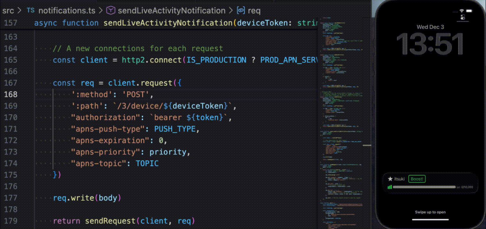

# Typescript: LiveActivityAPNServer

A sample implementation for ActivityKit Remote notification server to control Live Activities with push notifications remotely.

Specifically, this repository includes the following impelmentations
- Send push notifications for starting, updating, ending live activities on a single target(device)
- Start live activities that supports push updates on a channel
- send boradcast push notifications for updating, ending live activities on a channel
- Manage channels: create, get, list, delete

For more details, please refer to my blog
- [SwiftUI/LiveActivity: REMOTE Control With Push Notifications]()
- [SwiftUI/Live Activity: BroadCast Push Notifications]()
- [APN Server for Controlling Apple Live Activity]()
- [Server(Typescript) for APNS Broadcasting]()

## Set Up

1. Obtain a private key (with a .p8 file extension) and a key ID from developer account on [developer.apple.com](https://developer.apple.com/account/resources/keys/list)
2. Replace `APN_PRIVATE_KEY.p8` with your p8 key file above.
3. Obtain the TEAM_ID
4. Obtain the BUNDLE_ID for the app to send notification to.
5. Create an `.env` from `.env.pulic` and set up the corresponding environment variables.

## Testing

1. If you don't have an app already, you can Grab the sample App from my [GitHub](https://github.com/0Itsuki0/SwiftUI_LiveActivityWithPushNotification)
2. Run the app to obtain a push to start token
3. Call `startNewActivity` to start a new live activity with the token
4. Get the activity push token from the App
5. Call `updateActivity` or `endActivity` to update or end the activity

I have added a testing function in [index.ts](./src/index.ts) that you can just run with `npm run dev`.

## Demo

### Single Device

### Braodcast

## References

- Establishing a token-based connection to APNs: https://developer.apple.com/documentation/UserNotifications/establishing-a-token-based-connection-to-apns
- Generating a remote notification: https://developer.apple.com/documentation/UserNotifications/generating-a-remote-notification
- Starting and updating Live Activities with ActivityKit push notifications: https://developer.apple.com/documentation/activitykit/starting-and-updating-live-activities-with-activitykit-push-notifications
- Sending channel management requests to APNs: https://developer.apple.com/documentation/usernotifications/sending-channel-management-requests-to-apns
- Sending broadcast push notification requests to APNs: https://developer.apple.com/documentation/usernotifications/sending-broadcast-push-notification-requests-to-apns
